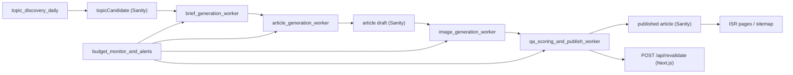

# Architecture Overview

## Summary
This MVP is a low-ops AI-assisted publishing system for a Home & DIY content site. It combines a premium frontend (`Next.js`), managed CMS (`Sanity`), and workflow automation (`n8n`) with budget-aware throttling.

## High-level Flow

## Components
- `apps/web`: public website, SEO metadata, schema.org, ad placeholders, revalidate endpoint.
- `apps/studio`: CMS authoring/ops console, schema types for pipeline entities.
- `infra/n8n`: automation runtime and workflow templates.
- `docs/prompts`: prompt templates versioned outside runtime for auditability.

## Core Contracts
- n8n writes/patches `topicCandidate`, `article`, `qaLog`, `generationRun` in Sanity.
- n8n triggers frontend ISR via `POST /api/revalidate` with secret header.
- Frontend reads only `status == published` content.

## Budget Strategy
- Generate many topic candidates (`20+/day`) but publish quota is throttled to fit budget.
- Mode transitions: `normal` -> `economy` -> `throttle` -> `stop`.
